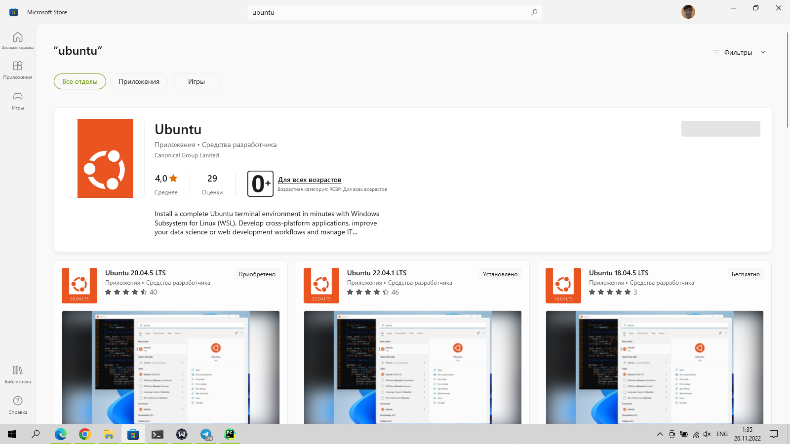

# Тема: Linux - введение

## Проверка домашнего задания

* Что такое фишинг?
* Что такое фишинговый сайт?
* Как можно определить, что сайт является фишинговым?

## Рассказ об ОС Linux

История Linux начинается в 1991 году, когда финский программист Линус
Торвальдс стал разрабатывать ядро операционной системы для своего
компьютера. Свои наработки он выложил на сервере, и это стало ключевым
событием в истории Linux. Сначала десятки, потом сотни и тысячи разработчиков
поддержали его проект - общими усилиями на свет появилась полноценная
операционная система.

Как уже было сказано, на Linux значительно повлияла система Unix, это заметно
даже по названию. Впрочем, изначально проект назывался Freax - от слов “free”
(бесплатный) и “freak” (странный), но в дальнейшем название было изменено на
гибрид имени создателя (Линус) и Unix.

Эмблемой Linux стал Такс (Tux) - пингвин, нарисованный в 1996 году
программистом и дизайнером Ларри Юингом. Впрочем, идею использовать
именно пингвина придумал сам Линус Торвальдс. Теперь Такс является символом
не только Linux, но и свободного программного обеспечения в целом.
Основным преимуществом этой ОС над ОС семейства Windows – это открытость
и большое количество дистрибутивов.

Дистрибутив – это набор файлов для корректной работы программы.
(Операционная система – это программа)

## Рассказ о том, что такое сервер

Сервер - это техническое решение, которое предоставляет множеству
компьютеров доступ к файлам, программам, ресурсам принтеров и сканеров и т.д.

Следовательно, от него зависит работа всех пользователей работающих на
сервере через свои персональные компьютерные.

Сервер, конечно же, тоже компьютер, но предназначенный для решения более
масштабных задач, или более требовательных к ресурсам программ.

Серверы могут быть различных типов, но в основном они делятся на два типа:

      * Сервера файлов
      * Сервера приложений

Сервер файлов - это сервер, который предоставляет доступ к файлам,
программам, ресурсам принтеров и сканеров и т.д.

Сервер приложений - это сервер, который предоставляет доступ к
приложениям, которые могут быть запущены на сервере.

## Что такое SSH

SSH - сетевой протокол прикладного уровня, позволяющий производить
удалённое управление операционной системой и туннелирование TCP-соединений (например, для передачи файлов). Схож по
функциональности с
протоколами Telnet и rlogin, но, в отличие от них, шифрует весь трафик, включая и
передаваемые пароли. SSH допускает выбор различных алгоритмов шифрования.
SSH-клиенты и SSH-серверы доступны для большинства сетевых операционных
систем

## Подключение к серверу

Для подключения к серверу необходимо знать его IP адрес.
(Как узнать IP адрес сервера?)

Для этого необходимо воспользоваться командой `ipconfig` в командной строке

После этого вам необходимо ввести команду:

`ssh имя_пользователя@ip_адрес_сервера`

После этого вам необходимо ввести пароль от сервера.

## Отображение текущей директории

Для отображения текущей директории необходимо воспользоваться командой `pwd`

## Отображение списка файлов

Для отображения списка файлов необходимо воспользоваться командой `ls`

`ls` - команда для просмотра файлов в текущей директории

`ls -l` - команда для просмотра файлов в текущей директории с подробной информацией

`ls -a` - команда для просмотра файлов в текущей директории с подробной информацией и скрытыми файлами

## Перемещение по файловой системе

Для перемещения по файловой системе необходимо воспользоваться командой `cd`

`cd ..` - команда для перемещения на уровень выше

`cd путь_до_директории` - команда для перемещения в директорию

## Создание файлов и директорий

Для создания файлов и директорий необходимо воспользоваться командами `touch` и `mkdir`

`touch имя_файла` - команда для создания файла

`mkdir имя_директории` - команда для создания директории

## Удаление файлов и директорий

Для удаления файлов и директорий необходимо воспользоваться командами `rm` и `rmdir`

`rm имя_файла` - команда для удаления файла

`rmdir имя_директории` - команда для удаления директории

`rm -r имя_директории` - команда для рекурсивного
удаления директории с файлами

## Просмотр содержимого файла

Для просмотра содержимого файла необходимо воспользоваться командой `cat`

`cat имя_файла` - команда для просмотра содержимого файла

## Очистка терминала

Для очистки терминала необходимо воспользоваться командой `clear`

## Редактирование файла

Для редактирования файла необходимо воспользоваться командой `nano`

`nano имя_файла` - команда для редактирования файла

## Как пользоваться nano

Для того чтобы выйти из редактора, необходимо нажать `Ctrl + X` и подтвердить сохранение файла нажатием `Y`

---

## Дополнительные команды

### Копирование файла или директории

`cp <имя файла> <путь, куда копировать>` - копирование файла

`cp -r <имя директории> <путь, куда копировать>` - копирование директории

### Перемещение файла или директории

`mv <имя файла> <путь, куда переместить>` - перемещение файла

`mv -r <имя директории> <путь, куда переместить>` - перемещение директории

Так же эту команду можно использовать для переименования файлов и директорий, например:

`mv <имя файла/директории> <новое имя файла/директории>` - переименование файла/директории

### Узнать пинг до сервера или сайта

`ping <адрес сервера или сайта>` - узнать пинг до сервера или сайта

### Скачать файл из интернета по ссылке

`wget <ссылка на файл>` - скачать файл

### Узнать IP адрес компьютера

`hostname -I` - узнать IP адрес компьютера

### Узнать, что делает команда

`man <команда>` - узнать, что делает команда

- например, чтобы узнать, что делает команда `ls`, нужно написать `man ls`

---

## Практическая работа

1. Мы будем работать в терминале linux онлайн. Для этого необходимо воспользоваться
   сервисом [www.webminal.org](https://www.webminal.org/)

    - Если вы не зарегистрированы, то необходимо
      зарегистрироваться [www.webminal.org/register/](https://www.webminal.org/register/) После регистрации необходимо
      нажать на кнопку `Start Terminal`
    - После нужно подтвердить регистрацию по ссылке в письме

2. Войдите в систему под своим логином и паролем

3. Работа в терминале:
    1. Создайте директорию со своим именем
    2. Перейдите в директорию со своим именем
    3. Посмотрите содержимое папки
    4. Создайте файл `hello.txt`
    5. Откройте файл `hello.txt` в редакторе `nano`
    6. Введите в файл `hello.txt` текст `Hello, World!`
    7. Сохраните файл `hello.txt`
    8. Просмотрите содержимое файла `hello.txt`
    9. Посмотрите содержимое папки
    10. Удалите файл `hello.txt`
    11. Посмотрите содержимое папки

## Дополнительные материалы

Для полноценной работы с linux необходимо установить виртуальную машину WSL(Windows Subsystem for Linux) или
использовать виртуальную машину с linux.

Для установки WSL необходимо выполнить следующие действия:

1. Открыть панель управления
2. Нажать на `Программы`
3. Нажать на `Включение или отключение функций Windows`
4. Включить `Windows Subsystem for Linux`
5. Перезагрузить компьютер
6. Открыть Microsoft Store
7. Найти `Ubuntu`
8. Установить `Ubuntu`
9. Запустить `Ubuntu`
10. Создать пользователя и пароль
11. Перезагрузить компьютер
12. Запустить `Ubuntu`
13. Войти под своим логином и паролем

[Инструкция](https://ubuntu-admin.ru/ubuntu-wsl/) как установить Ubuntu из магазина

## Домашнее задание

### Подготовка

1. Изучить дополнительные команды
2. Если есть возможность, то установите виртуальную машину с linux по инструкции выше
3. Если нет возможности установить виртуальную машину, то выполните задание в
   [терминале](https://www.tutorialspoint.com/unix_terminal_online.php) - это не тот, который мы использовали на занятии, но тут можно загружать файлы, что нам и понадобится

### Практическое задание:

1. Посмотрите в какой директории вы находитесь
2. Посмотрите содержимое директории
3. Создайте три файла с именами `file1.txt`, `file2.txt`, `file3.txt`
4. Удостоверьтесь, что файлы созданы
5. Переименуйте файл `file1.txt` в `file1.md`
6. Создайте директорию `test`
7. Переместите файл `file2.txt` в директорию `test`
8. Перейдите в директорию `test`
9. Посмотрите содержимое директории
10. Вернитесь на уровень выше
11. Посмотрите содержимое директории
12. Создайте директорию `Загрузки` и перейдите в нее
13. Скачать по ссылке `https://raw.githubusercontent.com/mokaruuns/codologia-web/main/hacker/2_Linux_introduction/result` - 
    1. это действие у вас не получится из-за ограничений этого терминала
    2. просто скопируйте содержимое файла в файл `result` в вашей директории `Загрузки`
    3. или установите виртуальную машину по инструкции выше и сделайте это там 

