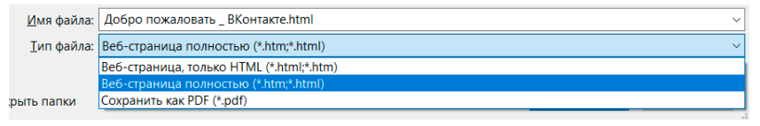

# Тема:

## Поиск форм на сайте

---

## Практическая работа

### Копирование форм

1. Перейдите на сайт https://vk.com :
    1. Откройте инструменты разработчика (F12)
    2. Перейдите во вкладку "Elements"
    3. Найдите форму авторизации
    4. Скопируйте её код в файл `vk.html`
        - copy -> copy outerHTML
2. Теперь скопируйте формы с сайтов в соответсвующие файлы:
    1. `https://mail.ru/`
    2. `https://store.steampowered.com/login/`

### Копирование сайта

1. Перейдите на сайт https://vk.com :
    1. Нажмите ctrl + s и сохраните страницу как `vk.html`
       
    2. Теперь скопируйте сайты в соответствующие файлы:
        1. `https://mail.ru/`
        2. `https://store.steampowered.com/login/`
    3. Откройте файлы в браузере и сравните их с оригиналами

2. Теперь скопируйте формы с сайтов в соответствующие файлы:
    1. `https://mail.ru/`
    2. `https://store.steampowered.com/login/`
    3. Сайт на свой выбор

### Создание своего сайта с формой

1. Создайте директорию `fishing_site`
2. Создайте файл `index.html` внутри директории `fishing_site`

## Дополнительные материалы

## Домашнее задание
