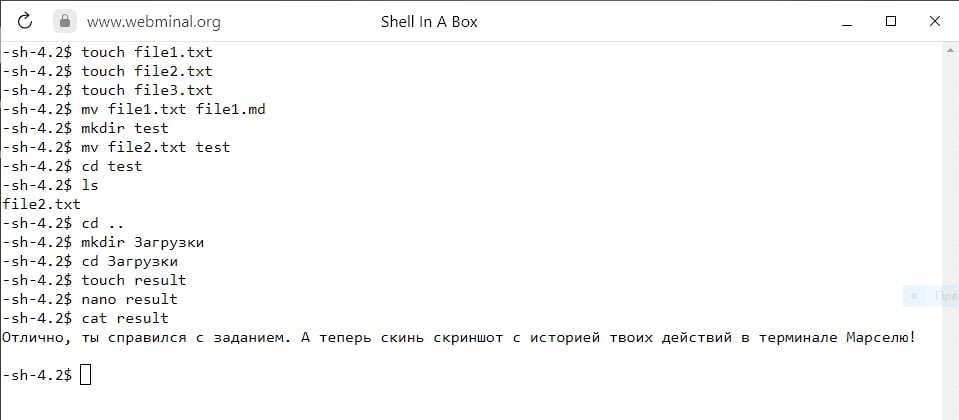
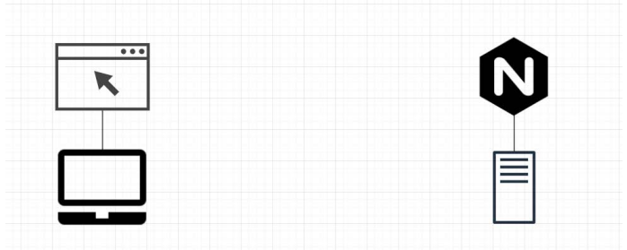
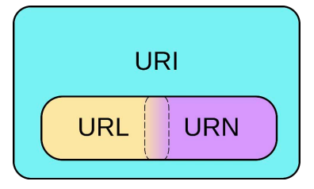
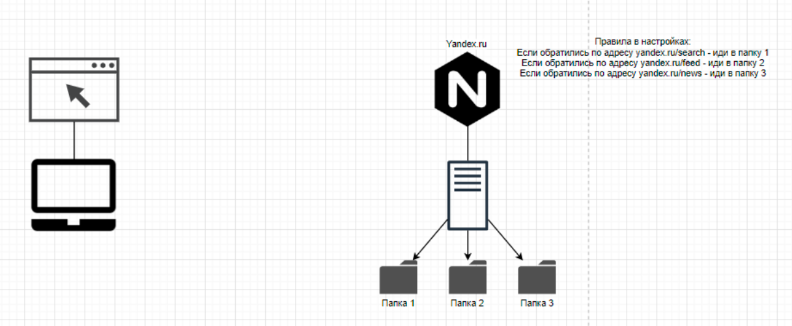
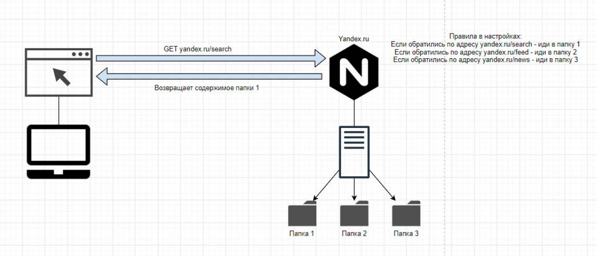
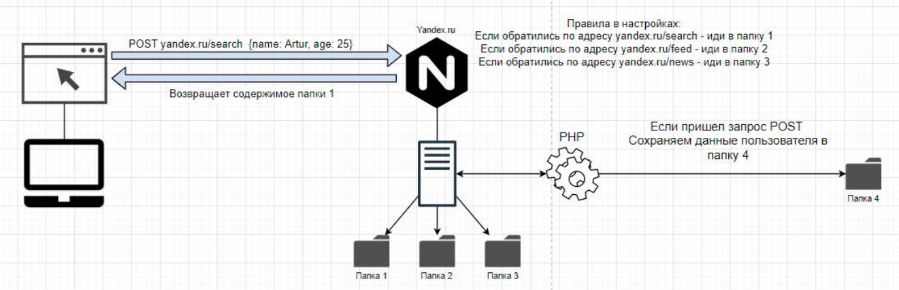

# Тема:

- Углубленное изучение HTML
- Формы
- Веб-запросы
- Готовим копию известного ресурса

## Проверка домашнего задания



- Что такое тег?
- Что такое атрибут тега?

## Этап 1 - веб-сервер



- Настольный ПК с установленным браузером
- Сервер с установленным веб-сервером

Веб-сервер — сервер, принимающий HTTP-запросы от клиентов, обычно веб-браузеров, и выдающий им HTTP-ответы, как правило,
вместе с HTML-страницей,
изображением, файлом, медиа-потоком или другими данными.

Когда мы вбиваем в адресную строку название какого-либо сайта, браузер делает
http запрос к веб-серверу.

В случае если uri верный, веб-сервер возвращает содержимое сайта, и браузер скачивает это содержимое в память
настольного
компьютера.

### URI



- URI - имя и адрес ресурса в сети, включает в себя URL и URN
- URL - адрес ресурса в сети, определяет местонахождение и способ обращения к нему
- URN - имя ресурса в сети, определяет только название ресурса, но не говорит как к нему подключиться

#### Примеры

- URI – ```https://wiki.merionet.ru/images/vse-chto-vam-nuzhno-znat-pro-devops/1.png```
- URL - ```https://wiki.merionet.ru```
- URN - ```images/vse-chto-vam-nuzhno-znat-pro-devops/1.png```

Сами данные сайта хранятся на сервере, а веб-сервер выступает связующей
частью. С одной стороны он имеет доступ к хранимым на сервере данным, с другой
стороны получает запросы из интернета. Правила, в которых прописаны настройки
называются конфигом веб-сервера. В конфиге настройки указаны в соответствии
со следующей структурой



## Этап 2 - Браузер делает запрос к серверу

### HTTP

Этот протокол описывает взаимодействие между двумя компьютерами
(клиентом и сервером), построенное на базе сообщений, называемых запрос
(Request) и ответ (Response).

Каждое сообщение состоит из трех частей:

- стартовая строка (обязательная)
- заголовки
- тело сообщения

**Стартовая строка** — это первая строка сообщения, в которой указывается тип
сообщения, адрес ресурса и версия протокола.

**Заголовки** — это набор пар имя-значение, разделенных двоеточием. В заголовках
передается различная служебная информация:

- кодировка сообщения
- название и версия браузера
- адрес, с которого пришел клиент (Referrer)
- и так далее

**Тело сообщения** — это данные, которые передаются в запросе или ответе.

#### Примеры

- GET / HTTP/1.1
- Host: wiki.merionet.ru
- User-Agent: Mozilla/5.0 (X11; Linux x86_64; rv:78.0) Gecko/20100101 Firefox/78.0

### GET и POST

**GET** — это метод запроса, который используется для получения данных с
сервера. Все данные передаются в виде параметров в URL. Параметры разделяются
символом &. Параметры могут быть как обязательными, так и необязательными.

Пример запроса:

```GET /index.php?param1=value1&param2=value2 HTTP/1.1```

**POST** — это метод запроса, который используется для отправки данных на
сервер. Все данные передаются в теле запроса и не отображаются в uri. Тело запроса может быть как
обязательным, так и необязательным.

Пример запроса:

```POST /index.php HTTP/1.1```

Итак, браузер отправляет запрос GET к серверу для отображения сайта. Веб-сервер проверяет, есть ли такой uri, и, если
есть, то дает возможность браузеру
скачать все данные сайта. Если же такого uri нет, то веб-сервер возвращает ошибку 404.


### Этап 3 - Обработка запроса

Логикой занимаются веб-приложения. Писать веб-приложения можно на языках программирования python, php, java, ruby и т.д.

Мы в будущем будем писать веб-приложения на php.

Сам код PHP внедряется в HTML документ сайта, но он не виден пользователю в
панели управления браузера.

Выполняется этот код на стороне сервера.



- Над стрелкой взаимодействия видим, что браузер отправил POST запрос с некоторыми
  данными в формате JSON.
- Веб-сервер получил этот запрос и передал его веб-приложению.
- Веб-приложение обработал запрос и вернуло ответ веб-серверу.
- Веб-сервер передал ответ браузеру.

#### JSON

JSON (JavaScript Object Notation) — это текстовый формат обмена данными.

Пример JSON:

```json
{
  "login": "mars",
  "password": "qwerty"
}
```

```json
{
  "name": "John",
  "age": 30,
  "cars": [
    {
      "name": "Ford",
      "models": [
        "Fiesta",
        "Focus",
        "Mustang"
      ]
    },
    {
      "name": "BMW",
      "models": [
        "320",
        "X3",
        "X5"
      ]
    },
    {
      "name": "Fiat",
      "models": [
        "500",
        "Panda"
      ]
    }
  ]
}
```

---

## Практическая работа

### Задание 1

Напишите данные о себе(имя, возраст, любимый цвет, любимая еда) в формате JSON.

### Задание 2

1. Для чего нужен веб-сервер и что это такое?
2. Что такое URI и из чего он состоит?
3. Какие существуют типы запросов и в чем их отличие?
4. Для чего нужен язык PHP при создании сайтов?

## Дополнительные материалы

## Домашнее задание
