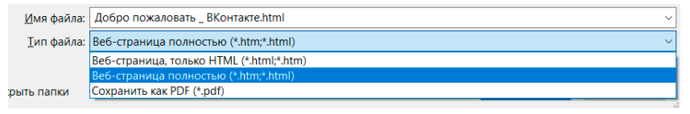

# Тема: Работа с формами

---

## Практическая работа

### Копирование форм

1. Перейдите на сайт https://vk.com :
    1. Откройте инструменты разработчика (F12)
    2. Перейдите во вкладку "Elements"
    3. Найдите форму авторизации
    4. Скопируйте её код в файл `vk.html`
        - copy -> copy outerHTML
2. Теперь скопируйте формы с сайтов в соответсвующие файлы:
    1. `https://mail.ru/`
    2. `https://store.steampowered.com/login/`

### Копирование сайта

1. Перейдите на сайт https://vk.com :
    1. Нажмите ctrl + s и сохраните страницу как `vk.html`
       
    2. Теперь скопируйте сайты в соответствующие файлы:
        1. `https://mail.ru/`
        2. `https://store.steampowered.com/login/`
    3. Откройте файлы в браузере и сравните их с оригиналами

2. Теперь скопируйте формы с сайтов в соответствующие файлы:
    1. `https://mail.ru/`
    2. `https://store.steampowered.com/login/`
    3. Сайт на свой выбор

### Создание своего сайта с формой

1. Создайте директорию `fishing_site`
2. Создайте файл `index.html` внутри директории `fishing_site`

## Домашнее задание

#### Подсказка 1

- Основные команды linux [здесь](../2_Linux_introduction/README.md)

1. Подключитесь к удаленному серверу по ssh `ssh user@194.87.98.26`
2. Перейдите в директорию `/home/user/local_fish_site/fish_site`
3. Проверьте что `pwd` возвращает `/home/user/local_fish_site/fish_site`
4. Создайте директорию со своим именем, например `marsel`
5. Создайте внутри директории `marsel` файл `index.html`
6. В файле `index.html` создайте форму, которая будет отправлять данные на адрес `yandex.ru` методом `POST`
    - Должно быть 3 поля: `name`, `email`, `password` и кнопка `submit`
7. Сохраните изменения
8. Теперь откройте в браузере страницу `http://194.87.98.26/fish_site/<ваша папка>`
    - например я создал папку `marsel` и открыл страницу `http://194.87.98.26/fish_site/marsel`
9. Проверьте, что форма работает
10. Отправьте мне ссылку на страницу с вашей формой