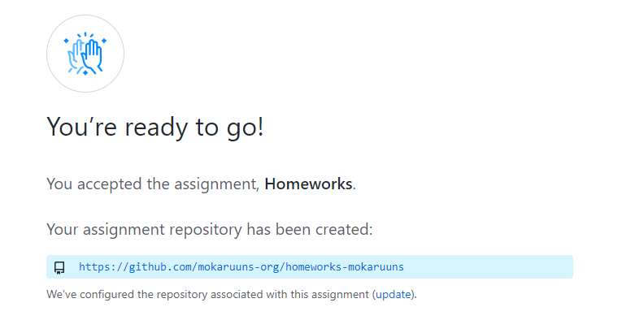
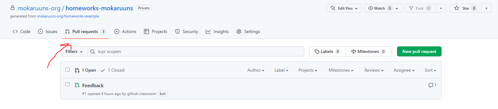
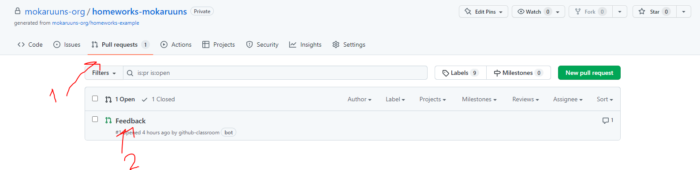
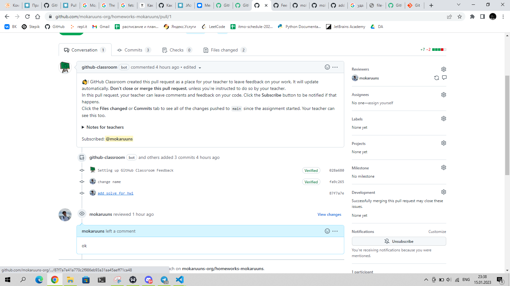

# Git

Очень полезная утилита для работы с репозиториями. Позволяет работать с репозиториями на удаленных серверах, а также с
локальными репозиториями.

## Установка

Для установки необходимо скачать установочный файл с официального сайта [git](https://git-scm.com/downloads) и запустить его.

## Настройка

Для настройки необходимо выполнить следующие команды:

    git config --global user.name "Имя Фамилия"
    git config --global user.email "почта"

## Создание репозитория

Для создания репозитория необходимо выполнить следующие команды:

    git init
    git add .
    git commit -m "Initial commit"

## Клонирование репозитория

Для клонирования репозитория необходимо выполнить следующие команды:

    git clone "адрес репозитория"

## Статус репозитория

Для получения статуса репозитория необходимо выполнить следующие команды:

    git status

## Добавление файлов в репозиторий

Для добавления файлов в репозиторий необходимо выполнить следующие команды:

    git add .
    git commit -m "Комментарий"

## Отправка изменений в репозиторий

Для отправки изменений в репозиторий необходимо выполнить следующие команды:

    git push

## Получение изменений из репозитория

Для получения изменений из репозитория необходимо выполнить следующие команды:

    git pull

## Список коммитов

Для получения списка коммитов необходимо выполнить следующие команды:

    git log

## Домашнее задание 

### Подготовка
- Установить на копьютер [git](https://git-scm.com/downloads)
- Зарегистрироваться на [github.com](https://github.com/)

### Вступление в класс
- Вступить в [classroom](https://classroom.github.com/a/8TOGjxjK)
    - Нажать на кнопку Accept this assignment
    - Нажать на кнопку Create repository, после чего будет создан репозиторий ваш личный репозиторий, в котором вы будете выполнять домашние задания
      

### Копирование репозитория
- Перейдите по ссылке на ваш репозиторий
- Склонируйте репозиторий на свой компьютер
    - Нажмите на кнопку `Code`
    - Скопируйте ссылку
    - Выполните команду `git clone <ссылка>` в терминале/консоли

### Локальная работа с репозиторием

- Внимательно прочитайте README.md в вашем репозитории
- В папке `hw0` создайте файл, опираясь на README.md в вашем репозитории
- Отправьте изменения в ваш репозиторий
    - Выполните команду `git add .`
    - Выполните команду `git commit -m "hw0"`
    - Выполните команду `git push` 
- Проверьте, что изменения появились в вашем репозитории

### Проверка домашнего задания

- Перейдите в ваш репозиторий
- Ещё раз проверьте, что в вашем репозитории обновились данные
- Напишите мне в телеграмме, что вы выполнили домашнее задание и готовы к проверке
- Перейдите во вкладку `Pull requests`
  
- Через некоторое время я проверю ваше домашнее задание и напишу комментарии в вашем репозитории
- Чтобы увидеть комментарии, перейдите откройте `Feedback` в вашем репозитории
  
- Вы увидете комментарии, которые я оставил в вашем репозитории
  

